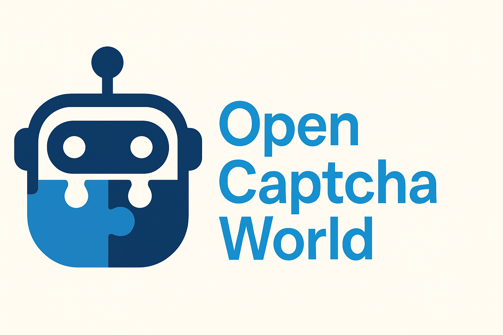
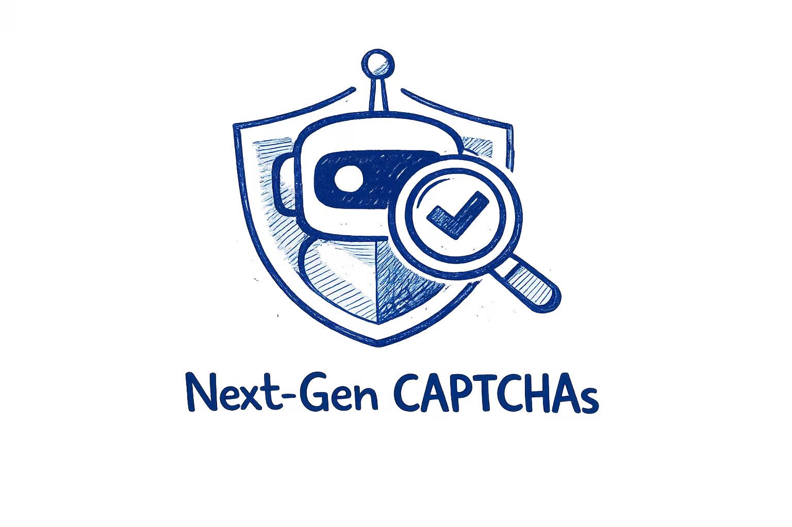

  
  
  &nbsp;&nbsp;&nbsp;&nbsp;
  
  
  
    
  
Built and maintained by researchers from MetaAgentX Team 

   

This organization contains the source code for projects that aim to advance Agents to Solve Diverse Real-World Deployment Tasks:
* [OpenCaptchaWorld](https://github.com/MetaAgentX/OpenCaptchaWorld), a benchmark and platform for evaluating Multimodal Agents on Modern Real-World CAPTCHAs.
* [Next-Gen CAPTCHAs](https://github.com/MetaAgentX/NextGen-CAPTCHAs), a GUI-Agent era's newly-designed web denfense CAPTCHAs System and also Benchmark for GUI Agents.

